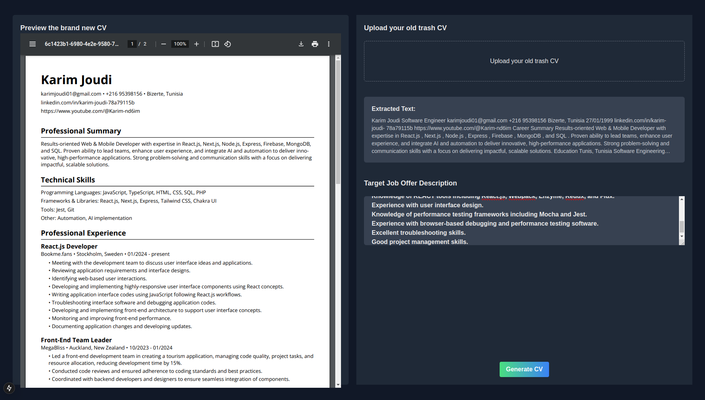

# The ultimate CV builder

The ultimate CV builder is a web application created with Next.JS aiming to generate the perfect CV for a job description using openAI. 

## Support me
[](https://www.buymeacoffee.com/karim.jd)


## Installation

```bash
npm install
```
or
```bash
yarn install
```

## Usage
1. Create a .env file 
  ```bash
    OPENAI_API_KEY= Paste your openAi API key
  ```

2. Run the project
```bash
 npm run dev
```
or
```bash
 yarn dev
```


3. Upload your CV
4. Paste the targeted job description
5. Click generate
6. Download the new CV



# Contributing to the Ultimate CV builder

We welcome contributions to the ultimate CV builder! Whether you're fixing bugs, adding new features, or improving documentation, we appreciate your help in making this project better. Please follow the guidelines below to ensure a smooth and effective contribution process.

## How to Contribute

1. **Fork the Repository**  
   Fork the repository by clicking the "Fork" button at the top of the project page.

2. **Clone Your Fork**  
   Clone the repository to your local machine:
   ```bash
    git clone https://github.com/your-username/your-repository.git
   ```
3. **Create a branch** 
   ```bash
    git checkout -b feature-name
   ```
4. **Push !**
   ```bash
    git push origin feature-nam
   ```


## License

[MIT](https://choosealicense.com/licenses/mit/)
